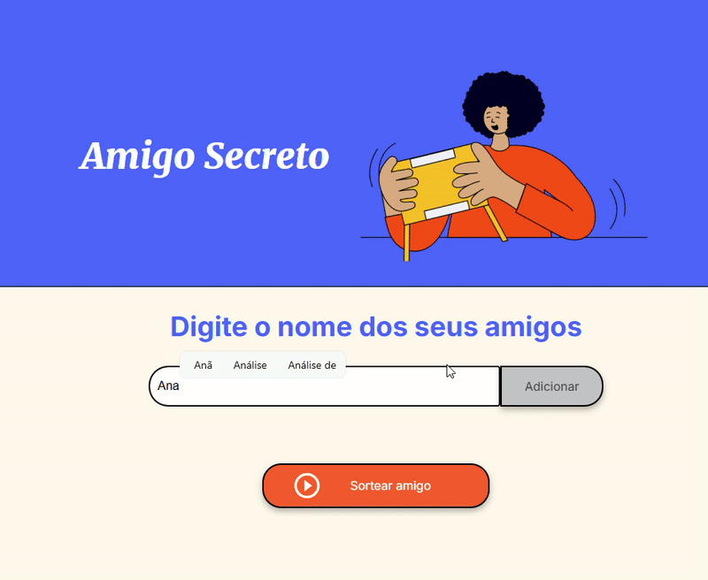

# CHALLENGE AMIGO SECRETO

É um desafio feito pela **Alura Latam** com a **Oracle** para o **Oracle Next Education**.

## 📌 Objetivo
O sistema foi desenvolvido para determinar um **amigo secreto**, permitindo aos usuários inserir os **nomes** dos seus **amigos** em uma lista e então sortear aquele que será o **amigo secreto**.

## ℹ️ Como funciona?
O **usuário** deverá **adicionar** nomes por meio de um campo de texto e de um botão "Adicionar".

Os **nomes** inseridos serão exibidos em uma lista visível na página, e ao finalizar, um botão "Sortear Amigo" selecionará um dos nomes de forma aleatória, exibindo o resultado na tela.

## 🛠️ Funcionalidades

- `Adicionar nomes:` Permite ao usuário adicionar o nome dos seus amigos em uma lista.
- `Validar entrada:` Verifica se o nome informado não é vazio e não está na lista atual.
- `Visualizar a lista:` Permite a visualização da lista de amigos.
- `Sorteio aleatório:` Sorteia o nome do amigo secreto através da geração de uma posição aleatória baseada no tamanho da lista de amigos.

## ▶️ Como instalar e rodar o projeto?
> [!NOTE]
> - Faça um fork ou um clone do repositório;
> - Siga até o diretório raiz do projeto;
> - Abra o arquivo index.html ou execute através do **Live Server** do VSCode

## 🐧 Autor
|  Mikhael D'Amato |
| :---: |